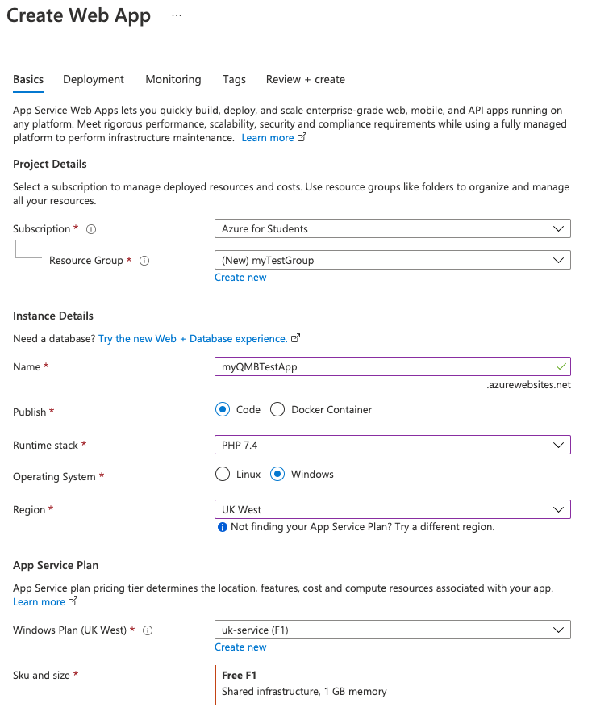
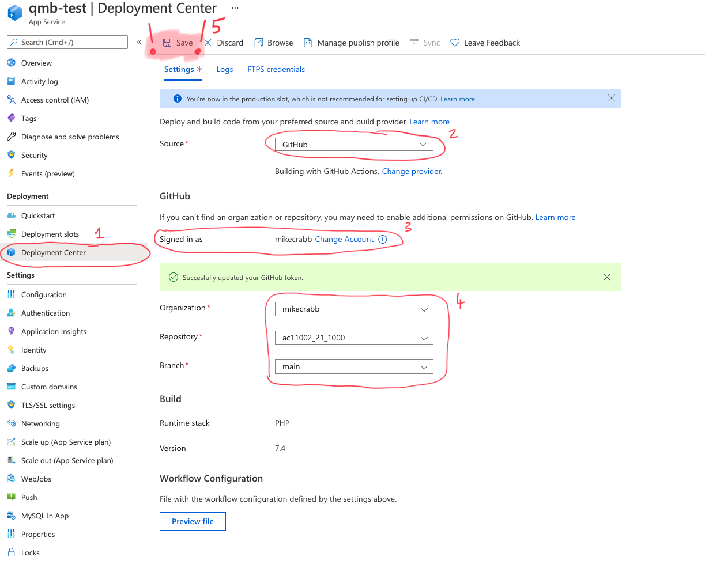
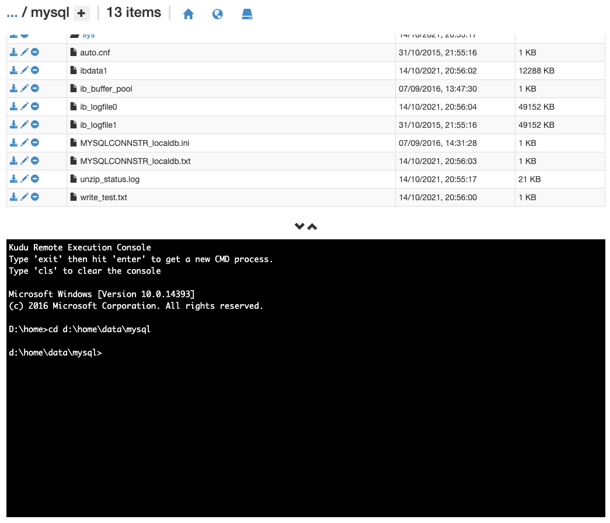

# Microsoft Azure Web App

Microsoft Azure has a number of free servies that are available to students. One of the most vercitile of these is the *App Service* that can be used to host full web applications (and more!)

| Service Name | Azure App Service |
|---|---|
| Official Documentation Link| https://azure.microsoft.com/en-us/services/app-service/#overview |
| Typical Use Case | A front and back end web application is needed to be hosted online |
| Sample Languages | Traditional Web Stack: PHP / mySQL </br> Modern Web Stack: Node |
| Notes | The Free tier of Azure Web App only supports services hosted on Windows Operating System, so you may not be able to use the most recent version of some Runtime Stacks. |

First, sign up for Azure for students by visiting https://azure.microsoft.com/en-gb/free/students/ and pressing Start for Free.

Once that has been completed you can visit https://portal.azure.com to find a list of all of your current Azure hosted applications. If this is the first time that you do this then you wont have any.

## Creating Your Application Resource

To create a new Web App, press *Create a Resource* and then Search For *Web App*. Create one of these.

The next page has a number of options that you will want to configure:

### Project Details
- *Subscription*: Make sure that ```Azure for Students``` is selected here
- *Resource Group*: On your first time, press Create new and make a new one, on additional occasions you can select a pre-existing group


### Instance Details
- *Name*: The name that you put here will exist in the URL for your site. My example is ```qmb-test.azurewebsites.net```
- *Publish*: Use Code by default, Docker if you know what you are doing with containers
- *Runtime Stack*: Select the stack that you want to use. If you want to create a PHP/mySQL stack, select ```PHP 7.4```, currently PHP 8 is not supported in Windows (neither is any Python or Ruby stack).
- *Region*: I generally select servers based in the UK as it makes GDPR things a bit eaiser.

### App Service Plan
- You want to make sure here that the plan you select is something that creates a ```Free F1``` final item. This is, unsurprisingly, free.

The final page will look somehting like this:



Once the above stages are complete, you can then press *Review + Create* > *Create*. A new page will load while everything is spining up, once complete press Go To Resource

## Setting Up Your WebApp to Use Continious Integration via GitHub

You can set up your application to automatically update any time a change has been made to a specific branch in a gitHub repository. To do this, visit the *Deployment Centre* (you can use the search box to find this) and then for the source, select ```GitHub```. 

Authenticate your GitHub Account, select the organisation that hosts your repository (most likely this will be your GitHub user name), select the repository, and then select the branch.

The save button is at the top of the page.



## Using mySQL in Your Application

In some cases you will want to use mySQL within your application, to enable this go to *MySQL In App* (again...search bar). Change this to *On* and then press Save. You can then manage your DB by pressing the Manage button at the top of the page. This should open up a phpMyAdmin window.

!> If you click Manage and a Login Window appears, visit the home page of your Web App to spin it into life. Refresh the phpMyAdmin window and it will give you access.

Once in PHPMyAdmin, you can play around with your Database by using '''localdb'''.

To use your database you will, as alway need to know the Dtabase Name, the Data Source, the Username and the Password. To find these go to *Advanced Tools > Debug Concole >CMD*. 

You then want to type in the console window ```cd d:\home\data\mysql```. Once done, scroll down through thefiles at the top until you find *MYSQLCONNSTR_localdb.txt*. Open this and you will have your connection string.

?> I would recommend saving this string directly to your gitHub repository and then using a .gitignore file to make sure you dont overwrite it for any local development that you are doing


