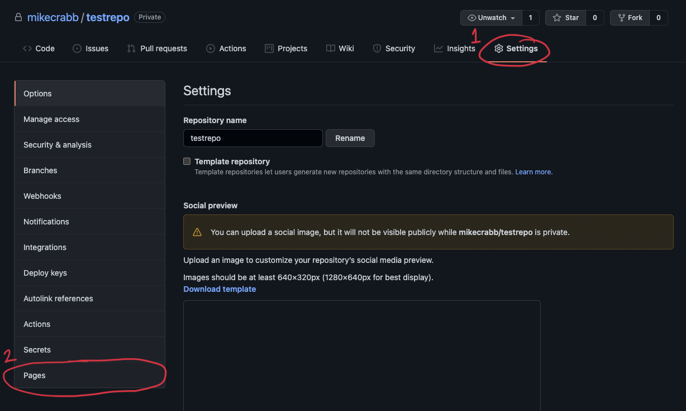
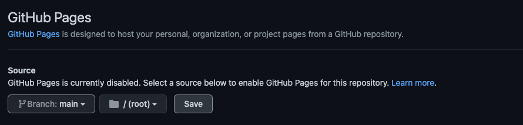

# Github Pages

Github pages is a free resource that is provided by GitHub. It allow for any Github hosted repository to be turned into a website that can then be accessed via URL.

| Service Name | GitHub Pages |
|---|---|
| Official Documentation Link| https://pages.github.com/ |
| Typical Use Case | A simple front end web application needs to be hosted |
| Sample Languages | HTML / CSS / JavaScript |
| Notes | GitHub Pages supports only *front end* languages so will be unsuitable for web applications that require back end support |

## Quick Start Guide

Within any GitHub repository, click on *Settings* and then *Pages*.



Pick the branch and the folder that you want your website to run from. Generally I would pick the main branch and the ```/(root)``` folder, you can pick others if you want but remember to place your web content in the right places. An common alternative is to place documentation in the ```docs``` folder and then host an appliation AND an accompanying website from the same repository.



Once this is completed, a box will appear stating that your site has been published. Initially this box will be blue while Github takes care of a few things but it will turn green after a few refreshes.

!> To save time later, take your website address and add it into your repository ABOUT information. Do do this, visit your repository home page, and press the small cog icon next to about in the right hand corner. You can then paste the link to your website repository in that space.